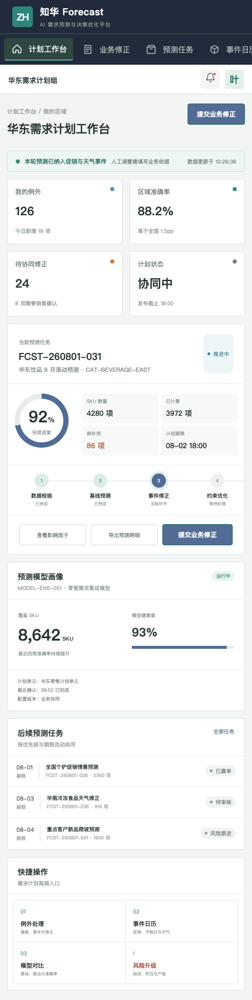
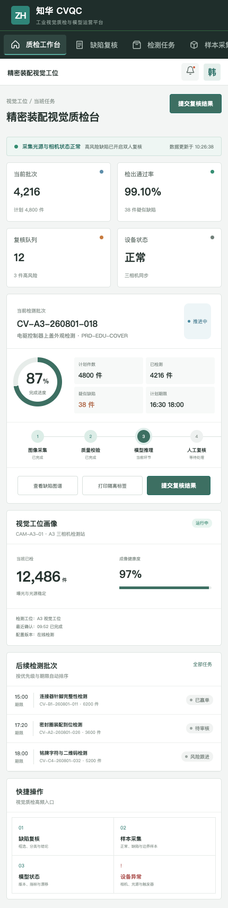

# ZhuaTech CVQC

## 工业视觉质检与模型运营平台 · 社区源码版

ZhuaTech CVQC 是知华科技（上海如静知华信息科技有限公司）面向制造企业打造的视觉质量平台，连接工业相机、边缘推理、缺陷复核、质量追溯和模型持续改进。[访问知华科技官网](https://www.zhuatech.cn/)



### 业务闭环

```text
图像采集 → 成像校验 → 模型推理 → 缺陷判定 → 人工复核 → 质量放行 → 样本回流
```

平台覆盖检测批次、视觉工位、样本标注、模型版本、灰度发布、漂移监控、缺陷图谱及审核追溯。低置信度和高风险缺陷自动进入人工复核，模型结果不会绕过企业质量流程。



缺陷处置决策新增安全关键件规则：综合模型置信度、缺陷面积、重复次数与安全属性，自动建议停线、人工复核或放行，同时给出风险等级和扩大抽样数量；最终放行权仍属于质量人员。

### 技术与功能

- Java 21 / Spring Boot / Spring Security / JWT / JPA / Flyway
- Vue 3 / Pinia / Vue Router / Vite / 响应式 H5
- MySQL 8 生产存储、H2 自动化测试、Docker Compose 部署
- 包名 `cn.zhuatech.cvqc`，数据库 `zhuatech_cvqc`
- 检测批次、相机工位、缺陷复核、模型评估、样本中心和质量分析
- `AiProvider` 提供视觉推理服务扩展点，仓库中无真实访问密钥

```bash
cd frontend && npm install && npm run dev:demo
```

管理端：`planner / Demo@2026`；质检端：`operator / Demo@2026`。所有演示产品、批次和检测数据均为虚构数据。

### 许可与联系

该工程仅可用于个人学习、研究及非商业交流，**不得用于商业用途**。生产使用、项目交付、企业内部部署、SaaS、二次销售、品牌替换和商业再分发，需要上海如静知华信息科技有限公司书面授权，详见 [LICENSE](LICENSE)。

| 技术咨询 | 商业授权 |
| --- | --- |
|  |  |

更多资料：[架构](docs/architecture.md) · [数据库](docs/database.md) · [接口](docs/api.md) · [部署](deploy/README.md)

SEO：工业视觉质检源码、AI 质检系统、缺陷检测平台、视觉模型运营、Java 视觉质检、Vue 质量系统、知华科技。
